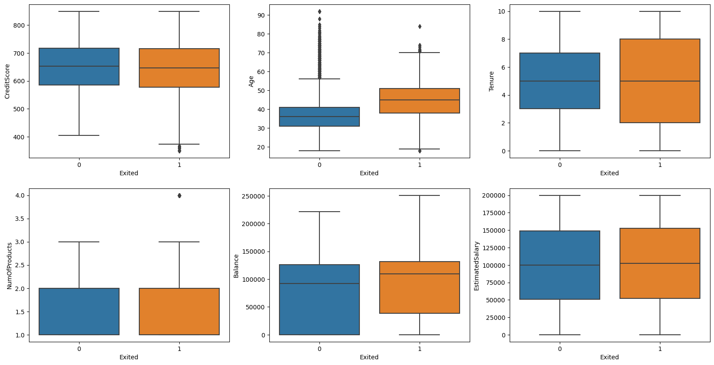
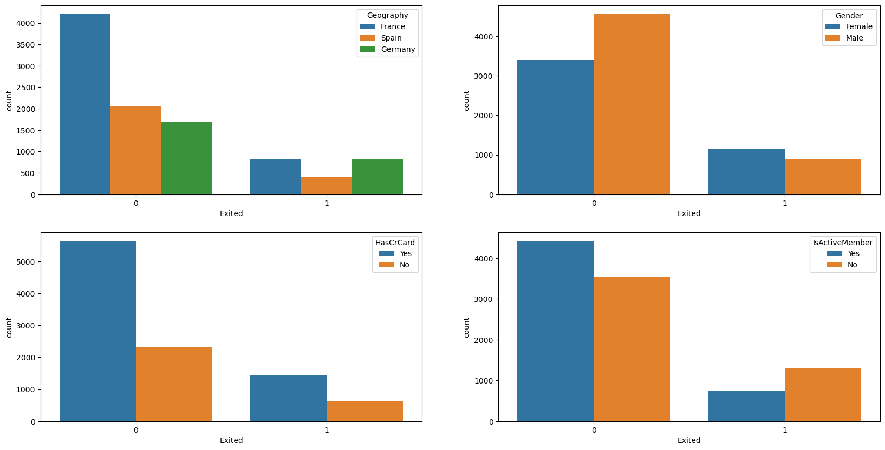
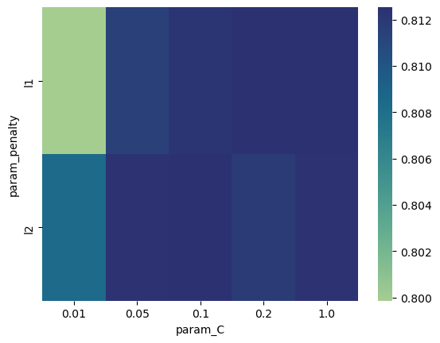
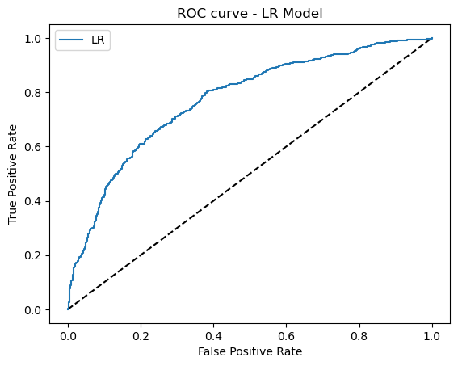
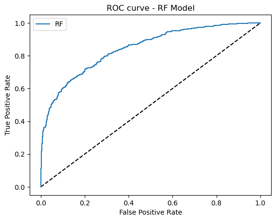
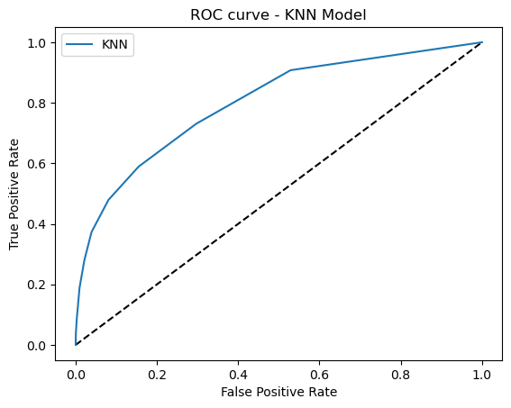

# Bank Customer Churn Prediction
This project uses logistic regression, K nearest neighbors, and random forest models to predict customer churn. The dataset contains features and behavior of customers from a bank. The goal is to find the most important features that contribute to customer retention, and to propose business strategies accordingly.

In the context of banking, customer churn means customers close their accounts or discontinue using the services provided by a specific bank. High churn rates can be caused by issues such as lack of competitive products and poor customer experience. Therefore, monitoring customer churn and analyzing the driving forces behind the change in customer churn offer banks valuable business insights into customer preferences, needs, and pain points.

## Project Structure
`data/': The dataset is from https://www.kaggle.com/code/kmalit/bank-customer-churn-prediction/data, containing features and exit behavior of 10,000 customers.

`images/': The folder contains data visualization and figures of model evaluation.

`Customer_Churn_Prediction.ipynb': The Jupyter notebook has codes for data exploration, feature preprocessing, model training and evaluation, and feature selection.

## Data Exploration
The dataset provides 10 useful attributes. 6 features are numerical, and 4 features are categorical. I use boxplots to show the distributions of numerical features for customers who exited and who stayed separately. The distributions of age, balance, and tenure are different across groups, suggesting these features can be important to explain why customers made different decisions. I use histograms to show the distributions of categorical features. Since there is significant difference in the distributions of country (market), gender, and whether the customer is an active member, these factors can also be vital to predict the decision of a customer.

## Model Training
I use 3 models to predict whether a customer stops doing the business with bank. The first model is logistic regression, and I use it as my benchmark model. The other 2 models I use are random forest and K nearest neighbors to see if prediction accuracy improves.

### Search for Optimal Hyperparameters
To avoid overfitting, I use regularization for logistic regression. I try different combinations of regularization methods and regularization parameters to decide on the best logistic regression model. The model that achieves the highest accuracy score uses L2 regularization and 10 as the regularization parameter.

I also change the number of neighbors to consider in the K-nearest neighbors model. The best KNN model uses 9 neighbors. I adjust the number and depth of decision trees in the random forest model, and the best random forest model uses 60 decision trees with max depth 10.

### Evaluation
To evaluate the 3 models I use, I compute evaluation metrics including accuracy, precision, and recall. Random forest performs best among the 3 models, because it has the highest accuracy, precision, and recall. Instead, logistic regression has mediocre performance with the lowest evaluation metrics. To provide a more uniform measure of model performance, I plot ROC curves for 3 models and compute the area under the ROC curve (AUC). Random forest has the highest AUC (0.84), which is significantly higher than the logistic regression model (0.77).

## Suggestions
What types of customers do we want to attract?

The results from the logistic regression show that there is positive correlation between exit behavior and age, balance, and estimated salary. German or female customers are also more likely to exit. On the other hand, being an active member is negatively correlated with exit.